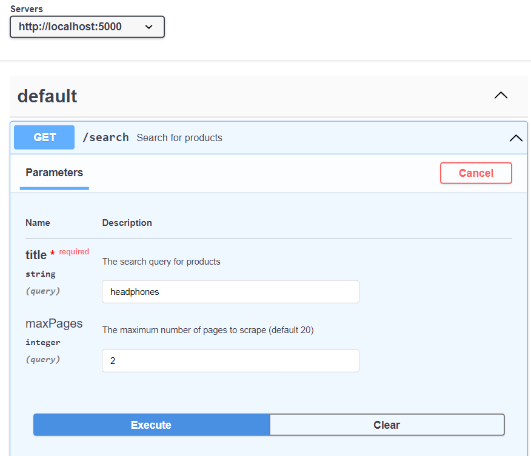

# Amazon API

The Amazon API project is a web application that allows users to search for products on Amazon and retrieve product information programmatically. It utilizes the Puppeteer library for web scraping, Express.js for building the API endpoints, and Swagger for API documentation.

## Features

- Search for products on Amazon by providing a search query.
- Retrieve product data, including name, price, and image, from the search results.
- Supports pagination to fetch multiple pages of search results.
- Retry mechanism for robustness in case of connection errors.
- RESTful API endpoints for performing searches and clearing search results.

## Prerequisites

Before running the project, make sure you have the following:

- Node.js and npm installed on your machine.
- API keys or credentials (if required) for accessing the Amazon website.

## Installation and Setup

1. Clone the repository: `git clone https://github.com/Percussor-hash/Amazon_API.git`
2. Install the dependencies: `npm install`
3. Configure the necessary environment variables (such as `PORT` for the server).

## Usage

1. Access the API documentation at `http://localhost:{PORT}/search` to explore the available endpoints and understand their usage.
2. Use the provided API endpoints to search for products on Amazon and retrieve the product data programmatically.


## Commands to run
<hr>

### Install all the node packages required
* ```cd Final_API```

* ```npm init``` (keep all the values to default.)

* ```npm install```

### Run the API
```node new.js```

## The URL link to Postman and ThunderClinet
### choose either one
1. For get request with its query:

    ```http://localhost:5000/search?title=<ProductName>&maxPages=<int>```

2. For Post request:

    ```http://localhost:5000/search```

    now select request body and choose JSON

JSON Content:

```
{ 
    "title": "<ProductName>", 
    "maxPages": <int>
}
```

### Now click the send button and the response will be like

``` 
[
  {
    "title": "string",
    "price": 0,
    "image": "string"
  }
]
```


## Node Packages used
<hr>

### dotenv:
1. dotenv is a lightweight library that simplifies the management of environment variables in your application by loading them from a .env file.
2. By using dotenv, you can keep sensitive information like API keys and database credentials separate from your codebase, providing an extra layer of security.
3. To use dotenv, simply create a .env file in the root directory of your project, define your environment variables there, and access them in your code using the process.env object. Make sure to exclude the .env file from version control to prevent exposing sensitive information.

### Expressjs:
1. Express.js is a fast and minimalist web application framework for Node.js, designed to build scalable and robust web applications and APIs.
2. With its simple and intuitive API, middleware support, and extensive ecosystem, Express.js allows developers to quickly create efficient and customizable web applications.

### Puppeteer:
1. Puppeteer is a powerful Node.js library developed by the Chrome team at Google, providing a high-level API to control headless Chrome or Chromium browsers programmatically.
2. With Puppeteer, you can automate web browsing tasks, perform web scraping, generate screenshots, test web pages, and interact with web applications, all through a programmatic interface.
3. Headless mode: With Puppeteer, you can launch a Chrome or Chromium browser instance in headless mode, which runs in the background without displaying a browser window. This allows you to perform automated tasks without any visual distractions or the need for manual interaction.
4. Web scraping: Headless browsers are commonly used for web scraping, which involves extracting data from websites. With Puppeteer, you can navigate through web pages, scrape HTML content, interact with JavaScript-based elements, and extract structured data for further analysis or storage.

### Body-parser:
In the code snippet above, the body-parser middleware is used to parse the JSON body of POST requests in the /search endpoint. This allows the server to access the request payload containing the search query and maximum pages to scrape.

### Cross-Origin Resource Sharing (CORS) Support

1. The application uses the `cors` module to enable Cross-Origin Resource Sharing, allowing the server to handle requests from different origins. This is important when the client-side code is served from a different domain or port than the server. The `cors` middleware is included in the application to handle CORS-related headers and allow cross-origin requests.

2. By using the `cors` module, the server can respond to requests from different origins without being blocked by the browser's same-origin policy. This enables the client-side code to make requests to the server, making it suitable for development, testing, and deployment scenarios where the client and server are hosted separately.

3. To configure CORS settings, you can modify the code in the `app.use(cors())` statement in the provided code snippet. This ensures that the server responds with the appropriate CORS headers, allowing cross-origin requests to be processed successfully.

## Other Tools
<hr>

### API Documentation with Swagger

The API is documented using the Swagger (OpenAPI) specification, providing a comprehensive and interactive documentation for developers. Swagger allows you to explore and understand the available endpoints, request parameters, response structures, and error codes.

To access the Swagger documentation, follow these steps:

1. Start the application on your local machine.
2. Go to "https://editor.swagger.io/" website and paste api.yaml code in the editor. 

The Swagger UI interface will be displayed, presenting a user-friendly view of the API documentation. You can interactively test the endpoints, view example requests and responses, and understand the expected data formats.

Using Swagger documentation, developers can easily integrate and consume the API by referring to the detailed specifications, reducing the learning curve and ensuring consistency in API usage.

Feel free to explore the Swagger documentation and leverage it to understand the available endpoints and interact with the API effectively.

### API Request Examples
<hr>



The above image shows an example of a GET request made to the API. It demonstrates how to retrieve product data by providing a search query.


The above image illustrates an example of a POST request made to the API. It showcases how to submit a search query and receive product data in the response.

